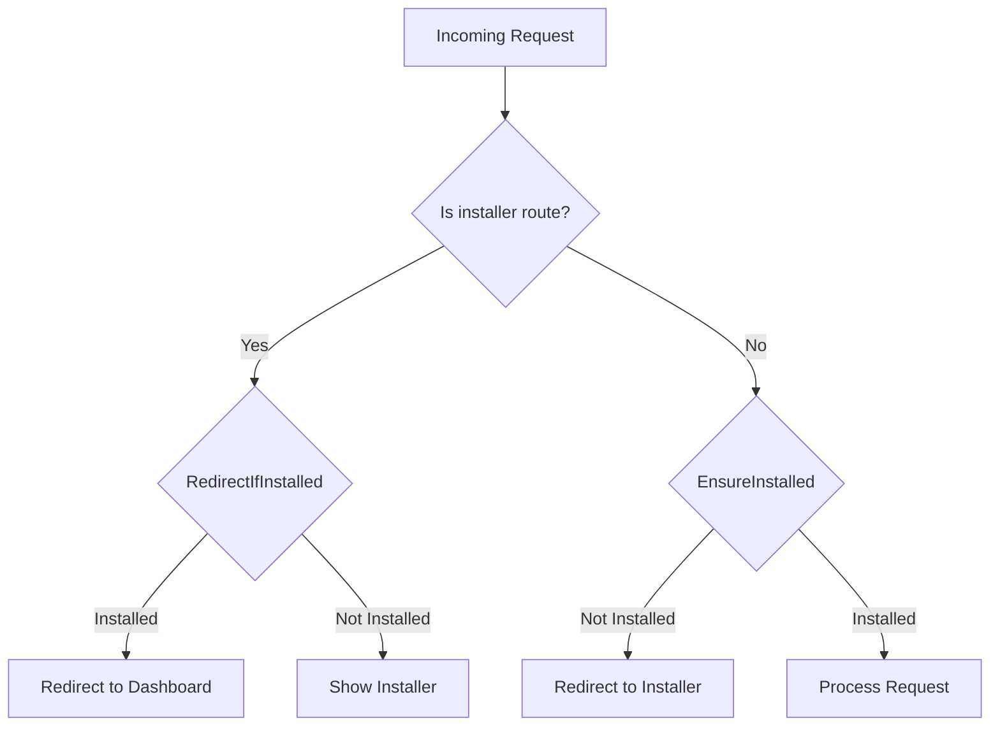

# Design Document: Envato Installer Wizard

## Overview

The Envato Installer Wizard is a Laravel 12 package that provides a professional, reusable installation wizard for commercial applications sold on Envato marketplaces. The package implements a multi-step wizard interface similar to WordPress installations, guiding users through server requirements checking, database configuration, license verification, and admin account setup.

The design follows a critical architectural principle: the installer code is never deleted after installation. Instead, access control is enforced through middleware that checks installation state stored in the database. This approach ensures safe updates, recovery capabilities, and professional-grade architecture that meets Envato reviewer requirements.

The package is built as a standalone, reusable component that can be integrated into multiple commercial products without modification. It uses Laravel 12's modern middleware registration system, Spatie's package tools for service provider configuration, and follows security best practices by never exposing sensitive credentials in the application code.

## Architecture

### High-Level Architecture

The installer follows a layered architecture with clear separation of concerns:

```
┌─────────────────────────────────────────────────────────┐
│                    HTTP Layer                            │
│  ┌──────────────┐  ┌──────────────┐  ┌──────────────┐  │
│  │  Middleware  │  │ Controllers  │  │    Routes    │  │
│  └──────────────┘  └──────────────┘  └──────────────┘  │
└─────────────────────────────────────────────────────────┘
                          │
┌─────────────────────────────────────────────────────────┐
│                   Service Layer                          │
│  ┌──────────────┐  ┌──────────────┐  ┌──────────────┐  │
│  │  Installer   │  │   License    │  │ Requirements │  │
│  │   Service    │  │   Service    │  │   Checker    │  │
│  └──────────────┘  └──────────────┘  └──────────────┘  │
└─────────────────────────────────────────────────────────┘
                          │
┌─────────────────────────────────────────────────────────┐
│                   Data Layer                             │
│  ┌──────────────┐  ┌──────────────┐  ┌──────────────┐  │
│  │   Settings   │  │    Users     │  │  .env File   │  │
│  │    Table     │  │    Table     │  │              │  │
│  └──────────────┘  └──────────────┘  └──────────────┘  │
└─────────────────────────────────────────────────────────┘
```

### Middleware Flow

The package implements two middleware classes that control access based on installation state:

**EnsureInstalled Middleware:**
- Applied globally to web routes in the host application
- Checks if `app_installed` is `true` in the settings table
- If not installed: redirects all requests to `/install` (except installer routes)
- If installed: allows requests to proceed normally
- Installer routes are always exempt from this check

**RedirectIfInstalled Middleware:**
- Applied only to installer route group
- Checks if `app_installed` is `true` in the settings table
- If installed: redirects to dashboard/home
- If not installed: allows access to installer



### Package Structure

```
src/
├── Http/
│   ├── Controllers/
│   │   ├── WelcomeController.php
│   │   ├── RequirementsController.php
│   │   ├── DatabaseController.php
│   │   ├── LicenseController.php
│   │   ├── AdminController.php
│   │   └── FinalizeController.php
│   └── Middleware/
│       ├── EnsureInstalled.php
│       └── RedirectIfInstalled.php
├── Services/
│   ├── InstallerService.php
│   ├── LicenseService.php
│   ├── RequirementsChecker.php
│   ├── DatabaseManager.php
│   └── EnvironmentManager.php
├── Commands/
│   └── UnlockInstallerCommand.php
├── Providers/
│   └── InstallerServiceProvider.php
└── Helpers/
    └── installer_helpers.php

resources/
└── views/
    └── installer/
        ├── layouts/
        │   └── master.blade.php
        ├── welcome.blade.php
        ├── requirements.blade.php
        ├── database.blade.php
        ├── license.blade.php
        ├── admin.blade.php
        └── finalize.blade.php

routes/
└── installer.php

config/
└── installer.php

database/
└── migrations/
    └── create_settings_table.php.stub
```

## Components and Interfaces

### 1. InstallerServiceProvider

**Responsibility:** Bootstrap the package and register all components with Laravel.

**Key Methods:**
- `configurePackage(Package $package): void` - Configure package using Spatie tools
- `boot(): void` - Register middleware, publish assets
- `registerMiddleware(): void` - Register middleware aliases with Laravel 12

**Configuration:**
```php
$package
    ->name('magic-installer')
    ->hasConfigFile('installer')
    ->hasViews('installer')
    ->hasRoute('installer')
    ->hasMigration('create_settings_table')
    ->hasCommand(UnlockInstallerCommand::class);
```

**Middleware Registration (Laravel 12):**
```php
// In boot() method, register with application
$this->app->make(\Illuminate\Foundation\Http\Kernel::class)
    ->appendMiddlewareToGroup('web', EnsureInstalled::class);

// Register aliases in bootstrap/app.php via package
$this->app->booted(function ($app) {
    $app->make('router')->aliasMiddleware('installer.redirect', RedirectIfInstalled::class);
});
```

### 2. Middleware Classes

#### EnsureInstalled

**Purpose:** Prevent access to application until installation is complete.

**Interface:**
```php
class EnsureInstalled
{
    public function __construct(
        private InstallerService $installer
    ) {}
    
    public function handle(Request $request, Closure $next): Response
    {
        // Check if route is installer route
        if ($request->is('install*')) {
            return $next($request);
        }
        
        // Check installation status
        if (!$this->installer->isInstalled()) {
            return redirect()->route('installer.welcome');
        }
        
        return $next($request);
    }
}
```

#### RedirectIfInstalled

**Purpose:** Prevent access to installer after installation is complete.

**Interface:**
```php
class RedirectIfInstalled
{
    public function __construct(
        private InstallerService $installer
    ) {}
    
    public function handle(Request $request, Closure $next): Response
    {
        if ($this->installer->isInstalled()) {
            return redirect()->route('dashboard');
        }
        
        return $next($request);
    }
}
```

### 3. InstallerService

**Responsibility:** Core service managing installation state and orchestrating the installation process.

**Interface:**
```php
class InstallerService
{
    public function __construct(
        private DatabaseManager $database,
        private EnvironmentManager $environment
    ) {}
    
    // Installation state management
    public function isInstalled(): bool;
    public function markAsInstalled(): void;
    public function markAsNotInstalled(): void;
    
    // Settings management
    public function getSetting(string $key, mixed $default = null): mixed;
    public function setSetting(string $key, mixed $value): void;
    public function hasSetting(string $key): bool;
    
    // Installation progress
    public function getCurrentStep(): int;
    public function setCurrentStep(int $step): void;
    public function completeStep(int $step): void;
    public function isStepCompleted(int $step): bool;
    
    // Finalization
    public function finalize(): void;
}
```

**Implementation Details:**
- Uses settings table for all state storage
- `app_installed` key stores boolean as string ("true"/"false")
- `current_step` key stores current wizard step (1-6)
- `completed_steps` key stores JSON array of completed step numbers
- `finalize()` method sets app_installed, clears cache, and performs cleanup

### 4. RequirementsChecker

**Responsibility:** Validate server environment meets application requirements.

**Interface:**
```php
class RequirementsChecker
{
    public function check(): array;
    public function checkPhpVersion(string $required): bool;
    public function checkExtension(string $extension): bool;
    public function checkDirectory(string $path): array; // ['exists' => bool, 'writable' => bool]
    public function getAllRequirements(): array;
}
```

**Requirements Checked:**
- PHP version >= 8.2
- Extensions: PDO, OpenSSL, Mbstring, Tokenizer, JSON, cURL, XML, Ctype, Fileinfo
- Writable directories: storage/, storage/app/, storage/framework/, storage/logs/, bootstrap/cache/

**Return Format:**
```php
[
    'php' => [
        'required' => '8.2',
        'current' => '8.4',
        'satisfied' => true
    ],
    'extensions' => [
        'pdo' => ['satisfied' => true],
        'openssl' => ['satisfied' => true],
        // ...
    ],
    'directories' => [
        'storage' => ['exists' => true, 'writable' => true, 'satisfied' => true],
        // ...
    ],
    'all_satisfied' => true
]
```

### 5. DatabaseManager

**Responsibility:** Handle database connection testing, configuration, and migrations.

**Interface:**
```php
class DatabaseManager
{
    public function testConnection(array $credentials): bool;
    public function writeConfiguration(array $credentials): void;
    public function runMigrations(): array; // Returns migration results
    public function createSettingsTable(): void;
}
```

**Database Credentials Structure:**
```php
[
    'host' => 'localhost',
    'port' => '3306',
    'database' => 'app_db',
    'username' => 'root',
    'password' => 'secret'
]
```

**Implementation Details:**
- Uses PDO for connection testing (before Laravel DB is configured)
- Writes to .env file using EnvironmentManager
- Runs `php artisan migrate --force` for migrations
- Captures and returns migration output for display

### 6. EnvironmentManager

**Responsibility:** Safely read and write .env file configuration.

**Interface:**
```php
class EnvironmentManager
{
    public function get(string $key): ?string;
    public function set(string $key, string $value): void;
    public function setMultiple(array $values): void;
    public function exists(string $key): bool;
}
```

**Implementation Details:**
- Reads .env file line by line
- Preserves comments and formatting
- Updates existing keys or appends new ones
- Handles quoted values properly
- Creates backup before writing (.env.backup)

### 7. LicenseService

**Responsibility:** Verify Envato purchase codes with external API.

**Interface:**
```php
class LicenseService
{
    public function __construct(
        private HttpClient $http
    ) {}
    
    public function verify(string $purchaseCode): LicenseVerificationResult;
    public function storeLicense(string $purchaseCode, array $data): void;
    public function getLicense(): ?array;
}
```

**LicenseVerificationResult:**
```php
class LicenseVerificationResult
{
    public function __construct(
        public bool $valid,
        public ?string $itemName,
        public ?string $buyerName,
        public ?string $purchaseDate,
        public ?string $supportedUntil,
        public ?string $error
    ) {}
    
    public function isValid(): bool;
    public function getError(): ?string;
}
```

**API Communication:**
- Sends POST request to configured License Verification API endpoint
- Payload: `{ "purchase_code": "xxx", "domain": "example.com", "app_id": "unique-id" }`
- Response: `{ "valid": true, "item_name": "...", "buyer": "...", "purchased_at": "...", "supported_until": "..." }`
- Stores hashed license reference in settings table
- Never stores Envato API token in application

### 8. Controllers

Each controller handles one step of the installation wizard:

**WelcomeController:**
- `index()` - Display welcome page with product info
- `store()` - Mark welcome step complete, redirect to requirements

**RequirementsController:**
- `index()` - Check and display server requirements
- `check()` - AJAX endpoint to re-check requirements
- `store()` - Verify all requirements met, proceed to database

**DatabaseController:**
- `index()` - Display database configuration form
- `test()` - AJAX endpoint to test database connection
- `store()` - Save database config, run migrations, proceed to license

**LicenseController:**
- `index()` - Display license verification form
- `verify()` - AJAX endpoint to verify purchase code
- `store()` - Save license data, proceed to admin setup

**AdminController:**
- `index()` - Display admin account creation form
- `store()` - Create admin user with role, proceed to finalization

**FinalizeController:**
- `index()` - Display finalization page
- `store()` - Mark installation complete, clear cache, redirect to dashboard

### 9. UnlockInstallerCommand

**Responsibility:** Provide CLI command to reset installation state for recovery.

**Interface:**
```php
class UnlockInstallerCommand extends Command
{
    protected $signature = 'installer:unlock {--force : Skip confirmation}';
    protected $description = 'Reset installation state to allow re-installation';
    
    public function handle(InstallerService $installer): int;
}
```

**Behavior:**
- Prompts for confirmation unless --force flag is used
- Sets `app_installed` to "false" in settings table
- Displays success message with next steps
- Returns exit code 0 on success

## Data Models

### Settings Table

**Purpose:** Store all installer and application configuration as key-value pairs.

**Schema:**
```php
Schema::create('settings', function (Blueprint $table) {
    $table->id();
    $table->string('key')->unique();
    $table->text('value')->nullable();
    $table->timestamps();
});
```

**Key Settings:**
- `app_installed` - "true" or "false" (string)
- `current_step` - Current wizard step number (1-6)
- `completed_steps` - JSON array of completed steps
- `license_hash` - Hashed license reference
- `license_data` - JSON encoded license information
- `installation_date` - Timestamp of installation completion

**Access Pattern:**
```php
// Via InstallerService
$installer->getSetting('app_installed'); // Returns "true" or "false"
$installer->setSetting('app_installed', 'true');

// Direct query (not recommended)
DB::table('settings')->where('key', 'app_installed')->value('value');
```

### Users Table

**Purpose:** Standard Laravel users table, used for admin account creation.

**Schema:** Uses Laravel's default users migration with Spatie Permission integration.

**Admin User Creation:**
```php
$user = User::create([
    'name' => $request->name,
    'email' => $request->email,
    'password' => Hash::make($request->password),
]);

$user->assignRole('admin'); // Via Spatie Permission
```

### Configuration File

**Purpose:** Allow product authors to customize installer behavior.

**Location:** `config/installer.php`

**Structure:**
```php
return [
    // Product information
    'product' => [
        'name' => env('APP_NAME', 'Laravel Application'),
        'version' => '1.0.0',
        'description' => 'Professional Laravel application with installer wizard',
    ],
    
    // Server requirements
    'requirements' => [
        'php' => '8.2',
        'extensions' => [
            'pdo', 'openssl', 'mbstring', 'tokenizer', 
            'json', 'curl', 'xml', 'ctype', 'fileinfo'
        ],
        'directories' => [
            'storage',
            'storage/app',
            'storage/framework',
            'storage/logs',
            'bootstrap/cache',
        ],
    ],
    
    // License verification
    'license' => [
        'enabled' => true,
        'api_endpoint' => env('LICENSE_API_ENDPOINT', 'https://license.example.com/api/verify'),
        'app_id' => env('LICENSE_APP_ID', ''),
    ],
    
    // Routes
    'routes' => [
        'prefix' => 'install',
        'middleware' => ['web', 'installer.redirect'],
        'redirect_after_install' => 'dashboard',
    ],
    
    // Admin role
    'admin' => [
        'role' => 'admin',
        'create_role_if_missing' => true,
    ],
];
```

## Correctness Properties

*A property is a characteristic or behavior that should hold true across all valid executions of a system—essentially, a formal statement about what the system should do. Properties serve as the bridge between human-readable specifications and machine-verifiable correctness guarantees.*


### Property 1: Installation State Persistence

*For any* installation completion, setting the installation state to complete should result in the `app_installed` key being set to "true" in the settings table, and subsequent checks should return installed status as true.

**Validates: Requirements 1.2, 1.3, 8.1**

### Property 2: Middleware Access Control - Not Installed

*For any* non-installer route, when the application is not installed, the EnsureInstalled middleware should redirect the request to the installer welcome page.

**Validates: Requirements 2.2**

### Property 3: Middleware Access Control - Installer Routes Exempt

*For any* installer route (routes starting with "install"), the EnsureInstalled middleware should allow the request to proceed regardless of installation status.

**Validates: Requirements 2.3**

### Property 4: Middleware Access Control - Installed

*For any* installer route, when the application is installed, the RedirectIfInstalled middleware should redirect the request to the dashboard.

**Validates: Requirements 2.5**

### Property 5: Step Progression

*For any* installation step, when that step is marked as completed, the installer should allow navigation to the next step in sequence.

**Validates: Requirements 3.8**

### Property 6: Requirements Validation Blocking

*For any* server requirement that fails validation, the installer should prevent progression to the database configuration step.

**Validates: Requirements 3.3**

### Property 7: Failed Requirements Display Errors

*For any* failed server requirement check, the installer should display an error message with remediation instructions.

**Validates: Requirements 4.5**

### Property 8: Database Connection Testing

*For any* database credential submission, the installer should test the database connection before proceeding.

**Validates: Requirements 5.2**

### Property 9: Successful Database Configuration Workflow

*For any* successful database connection, the installer should write the configuration to the .env file and then run database migrations.

**Validates: Requirements 5.4, 5.5**

### Property 10: License Verification API Communication

*For any* purchase code submission, the License Service should send a verification request to the License Verification API that includes the purchase code, application identifier, and domain.

**Validates: Requirements 6.2, 6.3**

### Property 11: License Storage After Verification

*For any* successful license verification, the installer should store a hashed license reference in the settings table.

**Validates: Requirements 6.6**

### Property 12: No API Token Storage

*For any* license verification operation, the installer should never store the Envato API token in the host application's database, configuration files, or .env file.

**Validates: Requirements 6.7**

### Property 13: Admin Email Validation

*For any* admin account submission with an invalid email format, the installer should reject the submission and display a validation error.

**Validates: Requirements 7.2**

### Property 14: Admin Password Validation

*For any* admin account submission with a password shorter than 8 characters, the installer should reject the submission and display a validation error.

**Validates: Requirements 7.3**

### Property 15: Admin User Creation and Role Assignment

*For any* valid admin account submission, the installer should create a user record in the database and assign the "admin" role using Spatie Permission.

**Validates: Requirements 7.4, 7.5**

### Property 16: Installation Finalization

*For any* installation finalization, the installer should set app_installed to "true", clear application cache, clear configuration cache, and redirect to the dashboard.

**Validates: Requirements 8.1, 8.2, 8.3**

### Property 17: Error Display Preserves Input

*For any* validation error or processing error, the installer should display the error message while preserving all user input in the form fields.

**Validates: Requirements 9.6**

### Property 18: Unlock Command Resets Installation

*For any* execution of the installer:unlock command, the installer should set app_installed to "false" in the settings table.

**Validates: Requirements 10.2**

### Property 19: Configuration Override

*For any* configuration key that exists in the published config file, the installer should use the published value instead of the default value.

**Validates: Requirements 11.6**

### Property 20: Service Provider Bootstrapping

*For any* package installation, the service provider should register installer routes, middleware aliases, and load installer views.

**Validates: Requirements 12.2, 12.3, 12.4**

### Property 21: Password Hashing

*For any* admin user creation, the password stored in the database should be hashed using Laravel's Hash facade, not stored in plain text.

**Validates: Requirements 13.1**

### Property 22: Input Validation

*For any* user input submitted through installer forms, the installer should validate and sanitize the input before processing.

**Validates: Requirements 13.2**

### Property 23: HTTPS for License API

*For any* license verification request, the License Service should use HTTPS protocol for communication with the License Verification API.

**Validates: Requirements 13.5**

### Property 24: No Credentials in Error Messages

*For any* error message displayed to users, the message should not contain database credentials (username, password, host).

**Validates: Requirements 13.6**

### Property 25: Environment File Preservation

*For any* .env file update operation, the EnvironmentManager should preserve all existing key-value pairs that are not being updated.

**Validates: Requirements 13.7**

### Property 26: Error Logging

*For any* error that occurs during installation, the installer should log the error to Laravel's log system.

**Validates: Requirements 14.5**

### Property 27: No Stack Traces in Production

*For any* error displayed to users when the application is in production mode, the error message should not include stack traces.

**Validates: Requirements 14.6**

### Property 28: Route Prefix Consistency

*For any* installer route, the route should have the "install" prefix.

**Validates: Requirements 15.2**

### Property 29: Named Routes

*For any* installer route, the route should have a name assigned for use in redirects and URL generation.

**Validates: Requirements 15.4**

### Property 30: Middleware Application

*For any* installer route, the RedirectIfInstalled middleware should be applied to the route.

**Validates: Requirements 15.5**

## Error Handling

### Error Categories

The installer handles four main categories of errors:

**1. Validation Errors**
- Invalid user input (email format, password length, etc.)
- Handled by Laravel's validation system
- Displayed inline with form fields
- User input is preserved for correction

**2. System Errors**
- File permission issues
- Directory not writable
- PHP extensions missing
- Displayed with specific remediation instructions
- Installation cannot proceed until resolved

**3. External Service Errors**
- Database connection failures
- License API unavailable or timeout
- Network connectivity issues
- Displayed with retry options
- Logged for debugging

**4. Application Errors**
- Migration failures
- User creation conflicts (duplicate email)
- Unexpected exceptions
- Displayed with generic error message
- Full details logged for support

### Error Display Strategy

**User-Facing Messages:**
- Clear, non-technical language
- Specific remediation steps when possible
- No sensitive information (credentials, tokens, paths)
- No stack traces in production mode

**Logging Strategy:**
- All errors logged to Laravel's log system
- Include context: step, user input (sanitized), system state
- Use appropriate log levels (error, warning, info)
- Sensitive data (passwords, tokens) never logged

**Error Recovery:**
- Form validation errors: preserve input, show inline errors
- System errors: show requirements page with failed items highlighted
- External service errors: provide retry button
- Application errors: offer to restart installation or contact support

### Example Error Handling

```php
// In DatabaseController
try {
    $this->databaseManager->testConnection($credentials);
} catch (PDOException $e) {
    Log::error('Database connection failed', [
        'step' => 'database',
        'host' => $credentials['host'],
        'database' => $credentials['database'],
        // Note: password is NOT logged
        'error' => $e->getMessage()
    ]);
    
    return back()
        ->withInput()
        ->withErrors([
            'database' => 'Could not connect to database. Please check your credentials and ensure the database server is running.'
        ]);
}
```

## Testing Strategy

### Dual Testing Approach

The installer will be validated using both unit tests and property-based tests, as these approaches are complementary and together provide comprehensive coverage:

**Unit Tests** validate:
- Specific examples and edge cases
- Integration points between components
- Error conditions with known inputs
- UI rendering and form field presence

**Property-Based Tests** validate:
- Universal properties that hold for all inputs
- Comprehensive input coverage through randomization
- Correctness properties from the design document

### Property-Based Testing Configuration

**Framework:** We will use [Pest PHP](https://pestphp.com/) with the [Pest Property Testing Plugin](https://github.com/pestphp/pest-plugin-property-testing) for property-based testing in PHP.

**Configuration:**
- Minimum 100 iterations per property test
- Each property test references its design document property
- Tag format: `Feature: envato-installer-wizard, Property {number}: {property_text}`

**Example Property Test:**
```php
// Feature: envato-installer-wizard, Property 1: Installation State Persistence
test('installation completion sets app_installed to true', function () {
    // Property test implementation
})->repeat(100);
```

### Test Organization

**Unit Tests:**
```
tests/
├── Unit/
│   ├── Services/
│   │   ├── InstallerServiceTest.php
│   │   ├── LicenseServiceTest.php
│   │   ├── RequirementsCheckerTest.php
│   │   ├── DatabaseManagerTest.php
│   │   └── EnvironmentManagerTest.php
│   ├── Middleware/
│   │   ├── EnsureInstalledTest.php
│   │   └── RedirectIfInstalledTest.php
│   └── Commands/
│       └── UnlockInstallerCommandTest.php
├── Feature/
│   ├── WelcomeStepTest.php
│   ├── RequirementsStepTest.php
│   ├── DatabaseStepTest.php
│   ├── LicenseStepTest.php
│   ├── AdminStepTest.php
│   └── FinalizeStepTest.php
└── Property/
    ├── InstallationStatePropertiesTest.php
    ├── MiddlewarePropertiesTest.php
    ├── ValidationPropertiesTest.php
    ├── SecurityPropertiesTest.php
    └── ConfigurationPropertiesTest.php
```

### Key Testing Scenarios

**Installation State:**
- Property: Installation completion always sets app_installed to true
- Unit: Test with specific installation scenarios
- Edge case: Missing settings table, corrupted data

**Middleware Behavior:**
- Property: All non-installer routes redirect when not installed
- Property: All installer routes are accessible when not installed
- Property: All installer routes redirect when installed
- Unit: Test specific routes and edge cases

**Validation:**
- Property: All invalid emails are rejected
- Property: All passwords under 8 characters are rejected
- Unit: Test specific invalid formats

**Security:**
- Property: All passwords are hashed before storage
- Property: No error messages contain credentials
- Property: No logs contain sensitive data
- Unit: Test specific security scenarios

**Configuration:**
- Property: Published config always overrides defaults
- Property: Environment file updates preserve existing keys
- Unit: Test specific configuration scenarios

### Mocking Strategy

**External Services:**
- License Verification API: Mock HTTP responses
- File system operations: Use virtual file system (vfsStream)
- Database: Use in-memory SQLite for tests

**Laravel Components:**
- Use Laravel's testing utilities (RefreshDatabase, WithoutMiddleware)
- Mock Artisan commands for migration testing
- Use view testing helpers for UI validation

### Test Data Generation

For property-based tests, we will generate:
- Random valid/invalid email addresses
- Random passwords of varying lengths
- Random database credentials
- Random purchase codes
- Random configuration values
- Random route paths

### Coverage Goals

- Minimum 80% code coverage
- 100% coverage of critical paths (installation flow, security)
- All 30 correctness properties implemented as property tests
- All edge cases covered by unit tests

## Deployment and Integration

### Package Installation

**Via Composer:**
```bash
composer require softcortex/magic-installer
```

**Auto-Discovery:**
The package uses Laravel's auto-discovery feature. No manual service provider registration is required.

### Initial Setup

**1. Publish Configuration (Optional):**
```bash
php artisan vendor:publish --tag=installer-config
```

**2. Publish Views (Optional, for customization):**
```bash
php artisan vendor:publish --tag=installer-views
```

**3. Run Migrations:**
```bash
php artisan migrate
```

### Host Application Integration

**Middleware Registration:**

The package automatically registers middleware, but the host application must apply EnsureInstalled to web routes. This is done in `bootstrap/app.php`:

```php
return Application::configure(basePath: dirname(__DIR__))
    ->withMiddleware(function (Middleware $middleware) {
        // Apply EnsureInstalled to all web routes
        $middleware->appendToGroup('web', \SoftCortex\Installer\Http\Middleware\EnsureInstalled::class);
    })
    ->create();
```

**Route Configuration:**

Installer routes are automatically registered by the package. No additional route configuration is needed.

**Environment Variables:**

Add to `.env`:
```env
LICENSE_API_ENDPOINT=https://license.example.com/api/verify
LICENSE_APP_ID=your-unique-app-id
```

### Customization

**Product Information:**

Edit `config/installer.php`:
```php
'product' => [
    'name' => 'Your Product Name',
    'version' => '1.0.0',
    'description' => 'Your product description',
],
```

**Requirements:**

Customize server requirements:
```php
'requirements' => [
    'php' => '8.2',
    'extensions' => ['pdo', 'openssl', 'mbstring', /* ... */],
],
```

**View Customization:**

After publishing views, customize Blade templates in `resources/views/vendor/installer/`.

### License Verification API Setup

The package requires an external License Verification API. This API should:

**Endpoint:** `POST /api/verify`

**Request:**
```json
{
    "purchase_code": "xxxxx-xxxxx-xxxxx",
    "domain": "example.com",
    "app_id": "unique-app-id"
}
```

**Response (Success):**
```json
{
    "valid": true,
    "item_name": "Product Name",
    "buyer": "Buyer Name",
    "purchased_at": "2024-01-01T00:00:00Z",
    "supported_until": "2025-01-01T00:00:00Z"
}
```

**Response (Failure):**
```json
{
    "valid": false,
    "error": "Invalid purchase code"
}
```

The API implementation is outside the scope of this package but should:
- Store Envato personal token securely
- Communicate with Envato API
- Enforce single-domain usage
- Implement rate limiting
- Handle blacklisting

### Production Deployment

**Before Deployment:**
1. Ensure `.env` is not committed to version control
2. Set `APP_ENV=production` in production environment
3. Configure License API endpoint and app ID
4. Test installation flow in staging environment

**After Deployment:**
1. Users access the application URL
2. Automatically redirected to `/install`
3. Complete installation wizard
4. Redirected to dashboard

**Post-Installation:**
- Installer routes remain accessible but redirect to dashboard
- Installation state persists in database
- Use `php artisan installer:unlock` for recovery if needed

### Troubleshooting

**Installation Stuck:**
```bash
php artisan installer:unlock
```

**Clear Caches:**
```bash
php artisan cache:clear
php artisan config:clear
php artisan view:clear
```

**Check Installation Status:**
```php
use SoftCortex\Installer\Services\InstallerService;

$installer = app(InstallerService::class);
$isInstalled = $installer->isInstalled(); // true or false
```

**Manual Database Check:**
```sql
SELECT * FROM settings WHERE key = 'app_installed';
```

## Security Considerations

### Credential Protection

**Never Stored in Application:**
- Envato API personal token (stored only in License Verification API)
- Database passwords (only in .env file, never in database)
- License purchase codes (only hashed reference stored)

**Secure Storage:**
- Admin passwords: Hashed using Laravel's Hash facade (bcrypt)
- License references: SHA-256 hash stored in settings table
- .env file: Protected by server configuration (not web-accessible)

### Input Validation

**All User Inputs Validated:**
- Email addresses: Laravel email validation rule
- Passwords: Minimum 8 characters, confirmed
- Database credentials: Sanitized before use in PDO connection
- Purchase codes: Alphanumeric validation before API call

**SQL Injection Prevention:**
- All database queries use Laravel's query builder or Eloquent
- PDO prepared statements for connection testing
- No raw SQL with user input

### CSRF Protection

**All Forms Protected:**
- Laravel's CSRF middleware applied to all installer routes
- `@csrf` directive in all Blade forms
- AJAX requests include CSRF token in headers

### Error Information Disclosure

**Production Mode:**
- No stack traces displayed to users
- Generic error messages for unexpected errors
- Detailed errors only in logs

**Sensitive Data:**
- Database credentials never in error messages
- API tokens never logged or displayed
- User passwords never logged

### HTTPS Enforcement

**License API:**
- All license verification requests use HTTPS
- Certificate validation enabled
- Timeout configured to prevent hanging

**Recommendation:**
- Host application should enforce HTTPS in production
- Use Laravel's `TrustProxies` middleware if behind load balancer

### File System Security

**Write Operations:**
- Only .env file is written (in application root)
- Backup created before writing (.env.backup)
- File permissions preserved
- Atomic write operation (write to temp, then rename)

**Directory Permissions:**
- Checked during requirements step
- Must be writable: storage/, bootstrap/cache/
- Installer does not modify file permissions

### Session Security

**Installation Progress:**
- Stored in database (settings table), not session
- Prevents session hijacking from affecting installation
- Survives server restarts

**Admin Creation:**
- Password confirmation required
- Email uniqueness enforced
- Role assignment via Spatie Permission (prevents privilege escalation)

### Rate Limiting

**License Verification:**
- Implemented in License Verification API (external)
- Prevents brute force purchase code attempts
- Recommended: 5 attempts per IP per hour

**Installation Attempts:**
- No built-in rate limiting (single installation per application)
- Host application can add rate limiting if needed

## Performance Considerations

### Database Queries

**Optimization:**
- Settings table uses indexed `key` column for fast lookups
- Installation state check is single query: `SELECT value FROM settings WHERE key = 'app_installed'`
- Middleware caches installation state for request duration

**Migration Performance:**
- Migrations run once during installation
- Progress displayed to user
- Timeout configured for large migrations

### File Operations

**Environment File:**
- Read once, parse, modify, write once
- Backup created before writing
- Atomic operation prevents corruption

**View Compilation:**
- Blade views compiled on first access
- Cached for subsequent requests
- Cleared during finalization

### HTTP Requests

**License Verification:**
- Single API call during installation
- Timeout configured (10 seconds)
- Retry logic for network failures
- Cached result for installation session

### Memory Usage

**Requirements Checker:**
- Lightweight checks (extension_loaded, is_writable)
- No large data structures
- Results cached for display

**Migration Execution:**
- Runs in separate process (artisan migrate)
- Output captured and displayed
- Memory limit inherited from PHP configuration

### Caching Strategy

**Installation State:**
- Cached in middleware for request duration
- Invalidated on installation completion
- No persistent cache (always check database)

**Configuration:**
- Laravel's config cache used in production
- Cleared during finalization
- Installer config loaded on demand

## Maintenance and Updates

### Package Updates

**Semantic Versioning:**
- Major: Breaking changes to API or database schema
- Minor: New features, backward compatible
- Patch: Bug fixes, security updates

**Update Process:**
```bash
composer update softcortex/magic-installer
php artisan migrate # If new migrations
php artisan view:clear # Clear compiled views
```

### Database Migrations

**Adding New Settings:**
- Use data migrations to add new settings keys
- Provide default values for existing installations
- Document in CHANGELOG

**Schema Changes:**
- Avoid breaking changes to settings table
- Use new tables for new features
- Provide migration path in documentation

### Backward Compatibility

**Configuration:**
- New config keys have defaults
- Old config keys deprecated, not removed
- Deprecation notices in documentation

**API:**
- Public methods maintain signatures
- New parameters added as optional
- Deprecated methods marked with `@deprecated`

### Support and Recovery

**Common Issues:**

1. **Installation Stuck:**
   - Solution: `php artisan installer:unlock`
   - Cause: Incomplete installation, server error

2. **License Verification Fails:**
   - Solution: Check API endpoint, network connectivity
   - Cause: API down, invalid purchase code, network issue

3. **Database Connection Fails:**
   - Solution: Verify credentials, database server running
   - Cause: Wrong credentials, database server down

4. **Migrations Fail:**
   - Solution: Check database permissions, review error log
   - Cause: Insufficient permissions, conflicting tables

**Debug Mode:**

Enable detailed logging:
```env
APP_DEBUG=true
LOG_LEVEL=debug
```

**Support Information:**

Collect for support tickets:
- Laravel version
- PHP version
- Package version
- Error logs from storage/logs/
- Installation step where error occurred

### Testing Updates

**Before Release:**
- Run full test suite (unit + property tests)
- Test installation on fresh Laravel 12 application
- Test update from previous version
- Test on minimum PHP version (8.2)

**Continuous Integration:**
- Automated tests on push
- Test against multiple Laravel versions (11, 12)
- Test against multiple PHP versions (8.2, 8.3, 8.4)

## Future Enhancements

### Planned Features

**Multi-Language Support:**
- Translate installer UI to multiple languages
- Language selection on welcome page
- Store language preference in settings

**Theme Customization:**
- Allow product authors to customize colors, logo
- Provide theme configuration in config file
- Support custom CSS injection

**SaaS Mode:**
- Support multi-tenant installations
- Tenant-specific license verification
- Tenant isolation in database

**Offline License Grace Period:**
- Allow installation without immediate license verification
- Grace period for offline installations
- Periodic license re-verification

**Advanced Requirements:**
- Check for specific PHP configuration (memory_limit, max_execution_time)
- Validate server software (Apache, Nginx)
- Check for recommended extensions (Redis, Memcached)

**Installation Wizard Customization:**
- Allow product authors to add custom steps
- Hook system for extending installation process
- Custom validation rules

**Backup and Restore:**
- Backup database before installation
- Restore point if installation fails
- Export/import installation configuration

### Community Contributions

**Welcome Contributions:**
- Bug fixes
- Documentation improvements
- Test coverage improvements
- Translation files

**Contribution Guidelines:**
- Follow PSR-12 coding standards
- Include tests for new features
- Update documentation
- Submit pull requests to develop branch

### Roadmap

**Version 1.1:**
- Multi-language support
- Theme customization
- Enhanced error messages

**Version 1.2:**
- SaaS mode support
- Custom installation steps
- Advanced requirements checking

**Version 2.0:**
- Complete UI redesign
- Vue.js frontend (optional)
- Real-time progress updates via WebSockets
